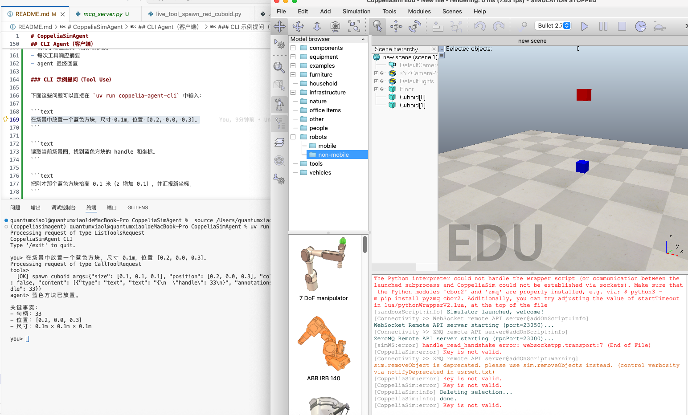

# CoppeliaSimAgent

面向 CoppeliaSim 的外部 Agent 工程骨架。目标是把底层 Remote API 封装为可被 LLM Function Calling 稳定调用的工具集。

## 测试结果截图

功能联调测试结果如下：



## Reference

[apiFunctions](https://manual.coppeliarobotics.com/en/apiFunctions.htm)

[zmqRemoteApiOverview](https://manual.coppeliarobotics.com/en/zmqRemoteApiOverview.htm)

## 当前状态

已完成第一阶段：

- `core/connection.py`: 全局连接管理、重连、`simIK/simOMPL` 预加载
- `tools/*`: 场景感知、基础几何体、模型管理、IK 与夹爪信号控制
- `agent/tool_registry.py`: 基于 Pydantic 的工具注册和 JSON Schema 导出
- `servers/mcp_server.py`: 将全部工具挂载为 MCP tools（stdio/sse/streamable-http）
- `agent/mcp_backend.py`: LLM agent backend（通过 MCP client 调用 tools）
- `cli/chat.py`: 对话式 CLI 客户端，展示工具调用与工具返回
- `tests/*`: 连接管理与工具层单元测试（mock/fake sim）
- `test/*`: 手动执行的真机脚本（连通性与逐工具验证）

## 目录结构

```text
src/coppeliasimagent/
├── __init__.py
├── config.py
├── core/
│   ├── __init__.py
│   ├── connection.py
│   └── exceptions.py
├── prompts/
│   ├── __init__.py
│   └── agent_system_prompt.md
├── servers/
│   ├── __init__.py
│   └── mcp_server.py
├── tools/
│   ├── __init__.py
│   ├── schemas.py
│   ├── scene.py
│   ├── primitives.py
│   ├── models.py
│   └── kinematics.py
├── agent/
│   ├── __init__.py
│   ├── tool_registry.py
│   └── mcp_backend.py
└── cli/
    ├── __init__.py
    └── chat.py
```

## 环境要求

- CoppeliaSim `v4.6.0+`
- Python `3.13+`
- `uv`

## 安装依赖

```bash
# uv lock --default-index "https://mirrors.tuna.tsinghua.edu.cn/pypi/web/simple"
uv sync
```

## 安装校验

```bash
uv pip show coppeliasimagent
```

如果输出包含 `Editable project location: /.../CoppeliaSimAgent`，说明当前环境已正确以可编辑模式指向本项目。

## Agent 环境变量（.env）

在项目根目录创建 `.env`：

```env
LLM_MODEL_NAME=qwen-max-latest
LLM_MODEL_BASE_URL=https://dashscope.aliyuncs.com/compatible-mode/v1
LLM_MODEL_API_KEY=your_api_key_here
```

## 自定义 Agent Prompt

- 默认系统提示词文件：`src/coppeliasimagent/prompts/agent_system_prompt.md`
- `MCPAgentBackend` 启动时会从该文件加载 prompt。
- 你可以直接修改该文件，让 agent 更偏向你的操作风格（例如更激进地自动调用工具、或更保守地先查询场景图）。

## 启动 CoppeliaSim

启动后确认日志包含：

```text
[sandboxScript:info] Simulator launched, welcome!
[Connectivity >> WebSocket remote API server@addOnScript:info] WebSocket Remote API server starting (port=23050)...
[Connectivity >> ZMQ remote API server@addOnScript:info] ZeroMQ Remote API server starting (rpcPort=23000)...
```

## 连通性测试

```bash
uv run test/connect_to_sim.py
```

可选参数：

```bash
uv run test/connect_to_sim.py --host 127.0.0.1 --zmq-port 23000 --timeout 3.0
uv run test/connect_to_sim.py --check-ws --ws-port 23050
```

注意：

- 默认不会探测 `23050`，以避免 `simWS ... handle_read_handshake ... End of File` 日志。
- 当你需要验证 WebSocket 端口时，再加 `--check-ws`。
- 以 `[PASS] ZMQ RPC OK ...` 为连接成功的关键判据。

## MCP Server 启动

stdio（给 agent backend 使用）：

```bash
uv run coppelia-mcp-server --transport stdio
```

HTTP（便于外部 MCP 客户端接入）：

```bash
uv run coppelia-mcp-server --transport streamable-http --host 127.0.0.1 --port 7777
```

模块启动方式：

```bash
uv run python -m coppeliasimagent.servers.mcp_server --transport streamable-http --port 7777
```

## 启动路径总览

- 仅开启 MCP server（给外部客户端连）：
  - `uv run coppelia-mcp-server --transport streamable-http --host 127.0.0.1 --port 7777`
- 开启 Agent backend + CLI（推荐本地交互）：
  - `uv run coppelia-agent-cli`
- 说明：
  - `agent backend` 当前是 `cli` 内部自动启动的（会拉起一个 stdio MCP server 子进程），不是单独的常驻命令。

## CLI Agent（客户端）

启动对话 CLI（会自动拉起一个 stdio MCP server backend）：

```bash
uv run coppelia-agent-cli
```

CLI 会展示：

- 调用了哪些工具（名称和参数）
- 每次工具响应摘要
- agent 最终回复

### CLI 示例提问（Tool Use）

下面这些问题可以直接在 `uv run coppelia-agent-cli` 中输入：

```text
在场景中放置一个蓝色方块，尺寸 0.1m，位置 [0.2, 0.0, 0.3]。
```

```text
读取当前场景图，找到蓝色方块的 handle 和坐标。
```

```text
把刚才那个蓝色方块抬高 0.1 米（z 增加 0.1），并汇报新坐标。
```

```text
如果存在与地面碰撞，先做碰撞检查再移动它。
```

```text
在场景中找到名字包含 lid 的物体，复制一个并移动到 [0.25, 0.0, 0.35]。
```

预期工具调用路径（示例）：

- `spawn_primitive` 或 `spawn_cuboid`
- `find_objects`
- `get_scene_graph`
- `duplicate_object`
- `set_object_pose`
- （可选）`check_collision`

## Live 工具脚本（逐个手动执行）

以下脚本会连接当前正在运行的 CoppeliaSim，并真实调用工具函数：

```bash
uv run test/live_tool_spawn_red_cuboid.py
uv run test/live_tool_move_red_cuboid.py
uv run test/live_tool_move_red_cuboid.py --handle 32 --target 0.2,0.0,0.3
uv run test/live_tool_remove_red_cuboid.py
uv run test/live_tool_remove_red_cuboid.py --handle 25
uv run test/live_tool_scene_graph.py --max-items 10
uv run test/live_tool_find_objects.py --name lid
uv run test/live_tool_duplicate_object.py --name lid --offset 0.15,0.0,0.0
uv run test/live_tool_check_collision.py
uv run test/live_tool_set_parent_child.py
```

放置机器人模型（需要你提供 `.ttm` 路径）：

```bash
uv run test/live_tool_load_robot_model.py --model-path /absolute/path/to/robot.ttm
```

说明：

- 这些脚本不是 `unittest` 用例，因此文件名不以 `test_` 开头。
- `tests/test_*.py` 用于离线单元测试，`test/live_tool_*.py` 用于在线真实仿真测试。
- `test/live_tool_move_red_cuboid.py --handle <id>` 可移动指定句柄到 `--target`。
- `test/live_tool_remove_red_cuboid.py --handle <id>` 会删除指定句柄；如果目标是系统对象或无效句柄，会返回 `found invalid handles`。
- `test/live_tool_duplicate_object.py` 支持 `--handle` 或 `--name` 两种源对象选择方式。

## 坐标约定

- 位置向量统一使用 `[x, y, z]`。
- `z` 是高度（up 轴）。
- 示例：`[0.2, 0.0, 0.3]` 表示离地 0.3 m。

## 工具函数概览

### 场景感知

- `get_scene_graph(include_types, round_digits)`
- `find_objects(name_query, exact_name, include_types, round_digits, limit)`
- `check_collision(entity1, entity2)`

### 基础几何体

- `spawn_primitive(primitive, size, position, color, dynamic, relative_to)`
- `spawn_cuboid(size, position, color, dynamic, relative_to)`
- `set_object_pose(handle, position, orientation_deg, relative_to)`
- `remove_object(handle)`
- `duplicate_object(handle, position, offset, relative_to)`

### 模型与装配

- `load_model(model_path, position, orientation_deg, relative_to)`
- `set_parent_child(child_handle, parent_handle, keep_in_place)`

### 运动学与末端执行器

- `spawn_waypoint(position, size, relative_to)`
- `setup_ik_link(base_handle, tip_handle, target_handle, constraints_mask)`
- `move_ik_target(environment_handle, group_handle, target_handle, position, relative_to, steps)`
- `actuate_gripper(signal_name, closed)`

## Pydantic 校验约定

所有工具函数在执行前都会经过 Pydantic 校验，主要约束：

- 向量参数必须是长度为 3 的有限数值
- 颜色范围必须在 `[0, 1]`
- 尺寸参数必须大于 `0`
- 旋转输入统一使用角度制 (`orientation_deg`)，底层自动转换弧度

## 运行单元测试

```bash
uv run python -m unittest discover -s tests -p "test_*.py"
```

这些测试不依赖实时 CoppeliaSim 进程，主要覆盖：

- 连接管理（超时、重连、插件可用性）
- 工具函数参数校验与 API 调用行为
- Tool registry 的 schema 导出与校验拦截
