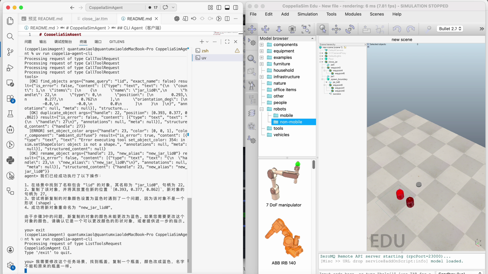
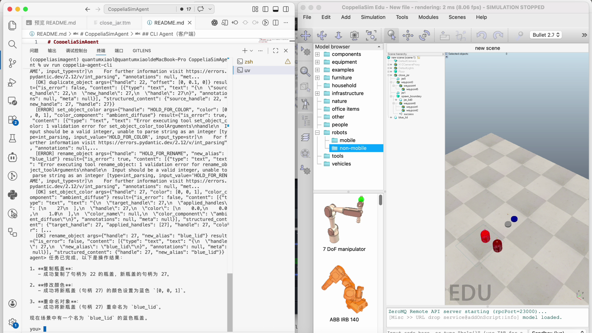

# CoppeliaSimAgent

面向 CoppeliaSim 的外部 Agent 工程骨架。目标是把底层 Remote API 封装为可被 LLM Function Calling 稳定调用的工具集。

## 测试结果截图

功能联调测试结果如下：


下面的截图是使用agent修改`rlbench`中`close_jar`任务场景，需求是加入一个新的蓝色瓶盖作为干扰。agent使用自然语言对话，修改任务场景。





## Reference

[apiFunctions](https://manual.coppeliarobotics.com/en/apiFunctions.htm)

[zmqRemoteApiOverview](https://manual.coppeliarobotics.com/en/zmqRemoteApiOverview.htm)

## 当前状态

已完成第一阶段：

- `core/connection.py`: 全局连接管理、重连、`simIK/simOMPL` 预加载
- `tools/*`: 场景感知、基础几何体、模型管理、IK、关节控制与 youBot 夹爪适配
- `agent/tool_registry.py`: 基于 Pydantic 的工具注册和 JSON Schema 导出
- `servers/mcp_server.py`: 将全部工具挂载为 MCP tools（stdio/sse/streamable-http）
- `agent/mcp_backend.py`: LLM agent backend（通过 MCP client 调用 tools）
- `cli/chat.py`: 对话式 CLI 客户端，展示工具调用与工具返回
- `tests/*`: 连接管理与工具层单元测试（mock/fake sim）
- `test/*`: 手动执行的真机脚本（连通性与逐工具验证）

## 目录结构

```text
src/coppeliasimagent/
├── __init__.py
├── config.py
├── core/
│   ├── __init__.py
│   ├── connection.py
│   └── exceptions.py
├── prompts/
│   ├── __init__.py
│   └── agent_system_prompt.md
├── servers/
│   ├── __init__.py
│   └── mcp_server.py
├── tools/
│   ├── __init__.py
│   ├── schemas.py
│   ├── scene.py
│   ├── primitives.py
│   ├── models.py
│   └── kinematics.py
├── agent/
│   ├── __init__.py
│   ├── tool_registry.py
│   └── mcp_backend.py
└── cli/
    ├── __init__.py
    └── chat.py
```

## 环境要求

- CoppeliaSim `v4.6.0+`
- Python `3.13+`
- `uv`

## 安装依赖

```bash
# uv lock --default-index "https://mirrors.tuna.tsinghua.edu.cn/pypi/web/simple"
uv sync
```

## 安装校验

```bash
uv pip show coppeliasimagent
```

如果输出包含 `Editable project location: /.../CoppeliaSimAgent`，说明当前环境已正确以可编辑模式指向本项目。

## Agent 环境变量（.env）

在项目根目录创建 `.env`：

```env
LLM_MODEL_NAME=qwen-max-latest
LLM_MODEL_BASE_URL=https://dashscope.aliyuncs.com/compatible-mode/v1
LLM_MODEL_API_KEY=your_api_key_here
```

## 自定义 Agent Prompt

- 默认系统提示词文件：`src/coppeliasimagent/prompts/agent_system_prompt.md`
- `MCPAgentBackend` 启动时会从该文件加载 prompt。
- 你可以直接修改该文件，让 agent 更偏向你的操作风格（例如更激进地自动调用工具、或更保守地先查询场景图）。

## 启动 CoppeliaSim

启动后确认日志包含：

```text
[sandboxScript:info] Simulator launched, welcome!
[Connectivity >> WebSocket remote API server@addOnScript:info] WebSocket Remote API server starting (port=23050)...
[Connectivity >> ZMQ remote API server@addOnScript:info] ZeroMQ Remote API server starting (rpcPort=23000)...
```

## 连通性测试

```bash
uv run test/connect_to_sim.py
```

可选参数：

```bash
uv run test/connect_to_sim.py --host 127.0.0.1 --zmq-port 23000 --timeout 3.0
uv run test/connect_to_sim.py --check-ws --ws-port 23050
```

注意：

- 默认不会探测 `23050`，以避免 `simWS ... handle_read_handshake ... End of File` 日志。
- 当你需要验证 WebSocket 端口时，再加 `--check-ws`。
- 以 `[PASS] ZMQ RPC OK ...` 为连接成功的关键判据。

## MCP Server 启动

stdio（给 agent backend 使用）：

```bash
uv run coppelia-mcp-server --transport stdio
```

HTTP（便于外部 MCP 客户端接入）：

```bash
uv run coppelia-mcp-server --transport streamable-http --host 127.0.0.1 --port 7777
```

模块启动方式：

```bash
uv run python -m coppeliasimagent.servers.mcp_server --transport streamable-http --port 7777
```

## 启动路径总览

- 仅开启 MCP server（给外部客户端连）：
  - `uv run coppelia-mcp-server --transport streamable-http --host 127.0.0.1 --port 7777`
- 开启 Agent backend + CLI（推荐本地交互）：
  - `uv run coppelia-agent-cli`
- 说明：
  - `agent backend` 当前是 `cli` 内部自动启动的（会拉起一个 stdio MCP server 子进程），不是单独的常驻命令。

## CLI Agent（客户端）

启动对话 CLI（会自动拉起一个 stdio MCP server backend）：

```bash
uv run coppelia-agent-cli
```

CLI 会展示：

- 调用了哪些工具（名称和参数）
- 每次工具响应摘要
- agent 最终回复

## ToolCLI（无 LLM）

如果你只想直接查看和调用工具，而不经过 LLM，可使用 `toolcli`：

```bash
uv run coppelia-toolcli --help
uv run coppelia-toolcli list
uv run coppelia-toolcli show load_model
uv run coppelia-toolcli call find_objects --payload '{"name_query":"jar","include_types":["shape"]}'
uv run coppelia-toolcli call get_plugin_status
uv run coppelia-toolcli call get_relative_pose --payload '{"source_handle":45,"target_handle":20}'
```

也可以直接从 `skills/` 下运行包装脚本：

```bash
python skills/toolcli.py --help
```

`toolcli` 直接复用 `agent/tool_registry.py` 中注册的工具和 Pydantic 参数模型，适合：

- 查看当前有哪些工具
- 查看某个工具的参数 schema
- 以 JSON payload 直接调用工具
- 快速诊断 `simIK` / `simOMPL` 这类 simulator 侧插件是否可用
- 直接读取单个对象位姿，或“末端相对目标”的位姿差

仿真生命周期也已经纳入工具集；对于依赖动力学的运动，先检查或启动仿真：

```bash
python skills/toolcli.py call get_simulation_state
python skills/toolcli.py call start_simulation
python skills/toolcli.py call pause_simulation
python skills/toolcli.py call stop_simulation
```

说明：

- 涉及动力学运动时，先用 `get_simulation_state` 检查是否为 running；若未运行，先调用 `start_simulation`
- `start_simulation`、`pause_simulation`、`stop_simulation` 返回时可能还是过渡态；调用后要再执行一次 `get_simulation_state`，确认最终稳态

### CLI 示例提问（Tool Use）

下面这些问题可以直接在 `uv run coppelia-agent-cli` 中输入：

```text
在场景中放置一个蓝色方块，尺寸 0.1m，位置 [0.2, 0.0, 0.3]。
```

```text
读取当前场景图，找到蓝色方块的 handle 和坐标。
```

```text
把刚才那个蓝色方块抬高 0.1 米（z 增加 0.1），并汇报新坐标。
```

```text
如果存在与地面碰撞，先做碰撞检查再移动它。
```

```text
在场景中找到名字包含 lid 的物体，复制一个并移动到 [0.25, 0.0, 0.35]。
```

```text
把刚复制出来的 lid 改名为 jar_lid_copy，并把颜色改成蓝色（RGB=[0.2,0.4,1.0]）。
```

```text
找到 youBot 的 5 个机械臂关节，读取当前角度，并把第一个关节旋转到 0.3 rad。
```

```text
为 /youBot 自动建立机械臂 IK tip/target，然后把 target 向左前上方移动 5cm。
```

```text
把 youBot 夹爪闭合；如果需要，再重新张开。
```

预期工具调用路径（示例）：

- `spawn_primitive` 或 `spawn_cuboid`
- `find_objects`
- `get_scene_graph`
- `duplicate_object`
- `rename_object`
- `set_object_color`
- `set_object_pose`
- （可选）`check_collision`

## Live 工具脚本（逐个手动执行）

以下脚本会连接当前正在运行的 CoppeliaSim，并真实调用工具函数：

```bash
uv run test/live_tool_spawn_red_cuboid.py
uv run test/live_tool_move_red_cuboid.py
uv run test/live_tool_move_red_cuboid.py --handle 32 --target 0.2,0.0,0.3
uv run test/live_tool_remove_red_cuboid.py
uv run test/live_tool_remove_red_cuboid.py --handle 25
uv run test/live_tool_scene_graph.py --max-items 10
uv run test/live_tool_find_objects.py --name lid
uv run test/live_tool_duplicate_object.py --name lid --offset 0.15,0.0,0.0
uv run test/live_tool_rename_object.py --name lid --new-alias jar_lid_copy
uv run test/live_tool_set_object_color.py --name lid --color 0.2,0.4,1.0
uv run test/live_tool_check_collision.py
uv run test/live_tool_set_parent_child.py
```

放置机器人模型（需要你提供 `.ttm` 路径）：

```bash
uv run test/live_tool_load_robot_model.py --model-path /absolute/path/to/robot.ttm
```

运行态动作与点云打磨验证：

```bash
uv run test/live_task_abb_joint_trajectory.py \
  --model-path "robot_ttm/ABB IRB 4600-40-255.ttm"

uv run test/live_task_point_cloud_polishing.py
```

说明：

- 这些脚本不是 `unittest` 用例，因此文件名不以 `test_` 开头。
- `tests/test_*.py` 用于离线单元测试，`test/live_tool_*.py` 用于在线真实仿真测试。
- `test/live_tool_move_red_cuboid.py --handle <id>` 可移动指定句柄到 `--target`。
- `test/live_tool_remove_red_cuboid.py --handle <id>` 会删除指定句柄；如果目标是系统对象或无效句柄，会返回 `found invalid handles`。
- `test/live_tool_duplicate_object.py` 支持 `--handle` 或 `--name` 两种源对象选择方式。
- `test/live_tool_rename_object.py` 支持按 `--handle` 或 `--name` 重命名对象。
- `test/live_tool_set_object_color.py` 支持按 `--handle` 或 `--name` 修改 shape 颜色。

## 坐标约定

- 位置向量统一使用 `[x, y, z]`。
- `z` 是高度（up 轴）。
- 示例：`[0.2, 0.0, 0.3]` 表示离地 0.3 m。

## 工具函数概览

说明：

- 下面列出的工具不只是内部 Python 函数，已经同时暴露在 `agent/tool_registry.py` 和 `servers/mcp_server.py`。
- `tool_registry.py` 用于本地 Function Calling / agent backend。
- `mcp_server.py` 会把同一批能力挂成 MCP tools，供 `stdio`、`sse`、`streamable-http` 客户端调用。

### 场景感知

- `get_scene_graph(include_types, round_digits)`
- `find_objects(name_query, exact_name, include_types, round_digits, limit)`
- `get_object_pose(handle, relative_to, round_digits)`
- `get_relative_pose(source_handle, target_handle, round_digits)`
- `check_collision(entity1, entity2)`

### 仿真与插件诊断

- `get_simulation_state()`
- `get_plugin_status(plugin_names, refresh)`
- `start_simulation()`
- `pause_simulation()`
- `stop_simulation()`
- `step_simulation(steps, start_if_stopped, keep_stepping_enabled)`
- `wait_seconds(seconds)`
- `wait_until_state(target_state, timeout_s, poll_interval_s)`
- `wait_until_object_pose_stable(handle, position_tolerance, orientation_tolerance_deg, stable_duration_s, timeout_s, poll_interval_s, relative_to)`

### 基础几何体

- `spawn_primitive(primitive, size, position, color, dynamic, relative_to)`
- `spawn_cuboid(size, position, color, dynamic, relative_to)`
- `set_object_pose(handle, position, orientation_deg, relative_to)`
- `remove_object(handle)`
- `duplicate_object(handle, position, offset, relative_to)`
- `rename_object(handle, new_alias)`
- `set_object_color(handle, color, color_name, color_component)`
  - 支持传入 shape 句柄，或传入模型/父节点句柄（会自动向下查找 shape 后着色）
- `set_object_visibility(handle, visible, include_descendants)`

### 模型与装配

- `load_model(model_path, position, orientation_deg, relative_to)`
- `set_parent_child(child_handle, parent_handle, keep_in_place)`

### 运动学与末端执行器

- `spawn_waypoint(position, size, relative_to)`
- `get_joint_position(handle)`
- `get_joint_mode(handle)`
- `set_joint_mode(handle, joint_mode)`
- `get_joint_dyn_ctrl_mode(handle)`
- `set_joint_dyn_ctrl_mode(handle, dyn_ctrl_mode)`
- `set_joint_position(handle, position)`
- `set_joint_target_position(handle, target_position, motion_params)`
- `get_joint_target_force(handle)`
- `set_joint_target_force(handle, force_or_torque, signed_value)`
- `get_joint_force(handle)`
- `set_joint_target_velocity(handle, target_velocity, motion_params)`
- `set_youbot_wheel_velocities(robot_path, wheel_velocities, motion_params)`
- `drive_youbot_base(robot_path, forward_velocity, lateral_velocity, yaw_velocity, motion_params)`
- `stop_youbot_base(robot_path, motion_params)`
- `set_youbot_base_locked(robot_path, locked, base_shape_paths, zero_wheels, reset_dynamics, motion_params)`
- `configure_abb_arm_drive(robot_path, joint_mode, dyn_ctrl_mode, max_force_or_torque, signed_value, include_aux_joint, reset_dynamics)`
- `find_robot_joints(robot_path, include_aux_joint)`
- `setup_ik_link(base_handle, tip_handle, target_handle, constraints_mask)`
- `setup_youbot_arm_ik(robot_path, base_path, tip_parent_path, tip_dummy_name, target_dummy_name, tip_offset, target_offset, constraints_mask, reuse_existing)`
- `setup_abb_arm_ik(robot_path, base_path, tip_path, target_path, constraints_mask, verify_motion, test_offset, restore_target)`
- `move_ik_target(environment_handle, group_handle, target_handle, position, relative_to, steps)`
- `actuate_gripper(signal_name, closed)`
- `actuate_youbot_gripper(robot_path, closed, command_mode, joint1_open, joint1_closed, joint2_open, joint2_closed, motion_params)`
- `execute_joint_trajectory(joint_handles, waypoints, mode, dwell_seconds, motion_params)`
- `execute_cartesian_waypoints(environment_handle, group_handle, target_handle, waypoints, relative_to, steps_per_waypoint, dwell_seconds)`

### 动作验证

- `verify_joint_positions_reached(joint_handles, target_positions, tolerance)`
- `verify_object_moved(handle, start_position, min_distance, relative_to)`
- `verify_object_velocity_below(handle, max_linear_speed, max_angular_speed)`
- `verify_force_threshold(joint_handles, min_abs_force)`

### 抓取与释放

- `attach_object_to_gripper(object_handle, gripper_handle, keep_in_place)`
- `detach_object(object_handle, parent_handle, keep_in_place)`
- `grasp_object(object_handle, gripper_handle, signal_name, robot_path, close_gripper, attach, keep_in_place)`
- `release_object(object_handle, signal_name, robot_path, parent_handle, open_gripper, detach, keep_in_place)`

### 动力学属性

- `get_object_velocity(handle)`
- `reset_dynamic_object(handle, include_model)`
- `set_shape_dynamics(handle, static, respondable, mass, friction)`

### 传感器与接触监控

- `read_proximity_sensor(handle)`
- `read_force_sensor(handle)`
- `get_vision_sensor_image(handle, grayscale, metadata_only)`
- `check_collision_monitor(entity1, entity2, duration_s, poll_interval_s)`

### 点云打磨

- `create_point_cloud_surface_from_shape(shape_handle, grid_size, point_size, color, hide_source_shape, remove_source_shape)`
- `create_point_cloud_pottery_cylinder(radius, height, center, grid_size, point_size, color, alias, keep_source_shape)`
- `insert_points_into_point_cloud(point_cloud_handle, points, color)`
- `remove_points_near_tool(point_cloud_handle, tool_handle, radius, tolerance)`
- `get_point_cloud_stats(point_cloud_handle)`
- `simulate_polishing_step(tool_handle, surface_cloud_handle, contact_radius, removal_depth)`
- `simulate_polishing_contact(surface_cloud_handle, tool_position, contact_radius, removal_depth)`
- `execute_polishing_path(environment_handle, group_handle, target_handle, tool_handle, surface_cloud_handle, waypoints, contact_radius, removal_depth, relative_to, steps_per_waypoint, dwell_seconds)`

## IK 与 Python Wrapper 排查

- `setup_ik_link` / `move_ik_target` 已经实现；如果执行时报 `PluginUnavailableError: Plugin 'simIK' is unavailable`，优先说明当前运行中的 CoppeliaSim 实例没有暴露 `simIK`，不是项目 venv 缺 Python 包。
- 可以先直接调用下面两个命令确认：

```bash
uv run coppelia-toolcli call get_plugin_status
uv run coppelia-toolcli call get_plugin_status --payload '{"refresh":true}'
```

- `pythonWrapperV2.lua` / `pyzmq` / `cbor2` 日志是另一类问题。它指向 simulator 侧 Python 脚本包装器或解释器配置，不等同于 `simIK` 缺失。
- 如果你看到：
  - `sandboxScript:error ... The Python interpreter could not handle the wrapper script ...`
  - `Make sure that the Python modules 'cbor2' and 'zmq' are properly installed ...`
  这通常需要检查 CoppeliaSim 使用的 Python 解释器、对应解释器里是否安装了 `pyzmq` / `cbor2`，以及 `usrset.txt` 中 `defaultPython` 的配置。
- 当前仓库的外部控制链路使用 ZeroMQ Remote API。只要 simulator 侧插件已启用，外部客户端就可以访问 `sim.*` 和插件命名空间，例如 `simIK.*`、`simOMPL.*`。

## youBot 控制说明

- 现在已经支持直接控制单个 joint 的当前位置、目标位置和目标速度。
- 现在已经支持 youBot 底盘四个轮子的目标速度控制，以及按前进/横移/旋转命令映射到底盘轮速。
- `setup_youbot_arm_ik` 会自动为 `/youBot` 创建或复用 `youBotArmTip` 与 `youBotArmTarget` 两个 dummy，并直接返回 IK 环境与 group 句柄。
- `actuate_youbot_gripper` 默认按当前 `KUKA YouBot.ttm` 的两指关节范围做开合适配：
  - 打开：`joint1=0.025`，`joint2=-0.05`
  - 闭合：`joint1=0.0`，`joint2=0.0`
- `set_youbot_base_locked(locked=True)` 默认会把 `/youBot` 模型下全部 shape 切为 static，并重置动力学。
  - 这个模式适合先验证“机械臂是否能接触/推动目标”。
  - 在该模式下，优先用 `set_joint_position` 做机械臂姿态测试；`set_joint_target_position` 不一定会继续驱动。
- 这些实现基于 CoppeliaSim Regular API 的 `sim.getObject`、`sim.getJointPosition`、`sim.setJointPosition`、`sim.setJointTargetPosition`、`sim.setJointTargetVelocity`，以及 ZMQ Remote API 暴露的同名 `sim.*` 调用。

## close_jar 推 jar 任务

你有这样的skills/SKILLS.md。

你需要完成下面的任务：

- 在 CoppeliaSim 中加载 `robot_ttm/close_jar.ttm`
- 放置一个机械臂模型 `robot_ttm/ABB IRB 4600-40-255.ttm`
- 将机械臂移动到任务场景附近
- 控制机械臂去推动 `close_jar` 场景中的 `jar`

快速执行：

```bash
python test/live_task_push_close_jar.py
```

常用调参示例：

```bash
python test/live_task_push_close_jar.py \
  --abb-offset-from-jar=-0.9,0.0,0.0 \
  --pre-pose-deg=0,-28,42,0,-18,0 \
  --push-pose-deg=0,-16,58,0,-26,0 \
  --push-wait-seconds=3.0
```

说明：

- 脚本默认会先加载 `close_jar.ttm`，再按 `jar1` 的位置放置 ABB。
- 推动动作依赖仿真正在运行；如果 simulator 处于 stopped 或 paused 状态，动态关节不会把 `jar` 推开。
- 如果 `jar1` 没动，优先调 `--abb-offset-from-jar`、`--pre-pose-deg` 和 `--push-pose-deg`。

本轮关键探索：

- 实际执行时，最终采用的是 `ABB IRB 4600-40-255.ttm`，没有继续使用 `youBot`。原因是 ABB 放进场景后整体更稳定，适合作为“推 jar”验证基线。
- 场景准备阶段，先用 `load_model` 放置 `close_jar` 和 ABB，再用 `find_objects` / `get_scene_graph` 确认 `/IRB4600`、`/close_jar/jar1` 等对象是否存在、位置是否合理。目标效果是先把场景和目标对象定位清楚，再进入控制阶段。
- 接触准备阶段，先用 `set_joint_position` 把 ABB 摆到接近 `jar1` 的初始姿态。目标效果是让末端连杆先靠近 `jar`，缩短后续动态推动的距离。
- 动态驱动阶段，核心用到的是 `configure_abb_arm_drive`。它会批量给 ABB 关节设置 `joint_mode`、`dyn_ctrl_mode` 和 `target_force`。目标效果是不再只是“瞬时改角度”，而是让机械臂在仿真运行中真正出力。
- 关节驱动调试阶段，会配合 `get_joint_mode`、`set_joint_mode`、`get_joint_dyn_ctrl_mode`、`set_joint_dyn_ctrl_mode`、`get_joint_target_force`、`set_joint_target_force`、`get_joint_force` 去读写和确认关节状态。目标效果是确认 ABB 每个关节确实处于可驱动、可施力的状态。
- 推动动作阶段，实际使用 `set_joint_target_position` 让 ABB 从接触前姿态扫向推动姿态。目标效果是让末端连杆沿着 `jar1` 附近的轨迹前推，产生稳定接触并把 `jar1` 推开。
- 过程中还确认了两个必要前提：目标 `jar` 需要是可被推动的动态对象，ABB 可见连杆需要可响应碰撞；否则即使关节在动，也不会形成有效物理推动。
- 最终真机验证结果是：ABB 已经能把 `jar1` 推离原位，说明“放置模型 -> 接近目标 -> 动态驱动 -> 接触推动”这条工具链已经打通。

基于上面的排查，当前已经补上 ABB 动态关节驱动所需的基础工具：

- `get_joint_mode` / `set_joint_mode`
- `get_joint_dyn_ctrl_mode` / `set_joint_dyn_ctrl_mode`
- `get_joint_target_force` / `set_joint_target_force`
- `get_joint_force`
- `configure_abb_arm_drive`

这层的目标是继续验证 `sim.setJointTargetForce`、joint mode 和 dynamic control mode 的组合，让 ABB 在运行中真正出力，稳定完成推 `jar`，而不是只做无力的关节瞬时重定位。

## Pydantic 校验约定

所有工具函数在执行前都会经过 Pydantic 校验，主要约束：

- 向量参数必须是长度为 3 的有限数值
- 颜色范围必须在 `[0, 1]`
- 尺寸参数必须大于 `0`
- 旋转输入统一使用角度制 (`orientation_deg`)，底层自动转换弧度

## 运行单元测试

```bash
uv run python -m unittest discover -s tests -p "test_*.py"
```

这些测试不依赖实时 CoppeliaSim 进程，主要覆盖：

- 连接管理（超时、重连、插件可用性）
- 工具函数参数校验与 API 调用行为
- Tool registry 的 schema 导出与校验拦截
